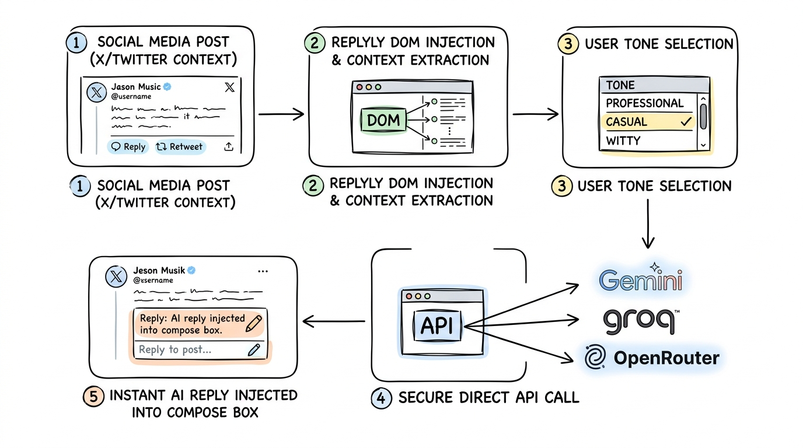
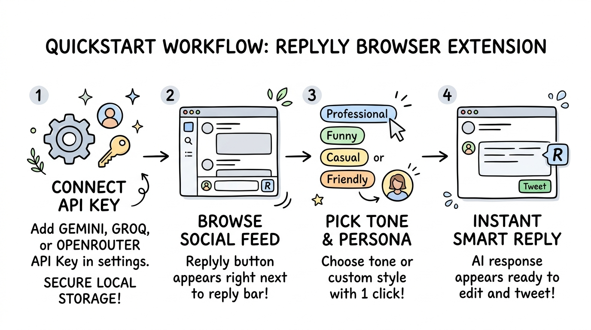

# Replyly

Intelligent, contextual AI-powered replies for social media feeds.

[](https://github.com/HeaLthyDrugs/replyly/actions/workflows/ci.yml)
[](https://github.com/HeaLthyDrugs/replyly/actions/workflows/release.yml)
[](LICENSE)
[](https://developer.chrome.com/docs/extensions/mv3/)

Replyly is a lightweight browser extension that generates natural, contextual replies on X (Twitter) using your preferred AI model (Google Gemini, Groq, or OpenRouter).

---

## How It Works



Replyly reads the active post context directly on your device, applies your selected tone, and sends a direct request to your chosen AI provider using your locally saved API key. The generated reply is inserted straight into the reply box.

---

## Quickstart: Install from Releases

No coding or build tools required.



### Step 1: Download & Extract
1. Go to the [Releases](https://github.com/HeaLthyDrugs/replyly/releases) page.
2. Download `chrome-mv3-prod.zip` from the latest release.
3. Unzip the file into a folder on your computer.

### Step 2: Load into Browser
1. Open your browser and navigate to `chrome://extensions` (Chrome, Brave, Arc, Edge).
2. Enable **Developer mode** (toggle in the top-right corner).
3. Click **Load unpacked** (top-left) and select the unzipped folder containing `manifest.json`.
4. Pin the **Replyly** icon to your toolbar.

### Step 3: Add API Key & Start Replying
1. Click the Replyly icon in your toolbar (or right-click $\rightarrow$ **Options**).
2. Choose your provider and paste your API key:
   - **Google Gemini**: [Google AI Studio](https://aistudio.google.com/)
   - **Groq**: [Groq Console](https://console.groq.com/)
   - **OpenRouter**: [OpenRouter Portal](https://openrouter.ai/)
3. Go to [x.com](https://x.com), click the Replyly button on any post, pick a tone, and get instant replies.

---

## Features

- **Context-Aware**: Generates relevant replies based on the post conversation.
- **Multiple AI Providers**: Support for Google Gemini, Groq (Llama models), and OpenRouter (Claude, GPT, DeepSeek).
- **Tone Presets**: Switch between Professional, Casual, Witty, and Custom prompts.
- **Privacy-First**: API keys stay in your browser (`chrome.storage.local`). Zero tracking, zero telemetry.

---

## Developer Guide

### Local Setup
```bash
git clone https://github.com/HeaLthyDrugs/replyly.git
cd replyly
pnpm install
pnpm dev       # Live development at build/chrome-mv3-dev
pnpm package   # Builds production zip at build/chrome-mv3-prod.zip
```

### Docker Setup
```bash
docker compose run --rm build   # Build production bundle to ./build
docker compose up dev           # Run live development server
```

---

## Release Workflow

Publishing a release is automated via GitHub Actions:
```bash
git tag v0.0.2
git push origin v0.0.2
```
Pushing a tag automatically triggers `.github/workflows/release.yml`, which builds and attaches `chrome-mv3-prod.zip` to a new GitHub Release.

---

## License

MIT License. See [LICENSE](LICENSE) for details.
